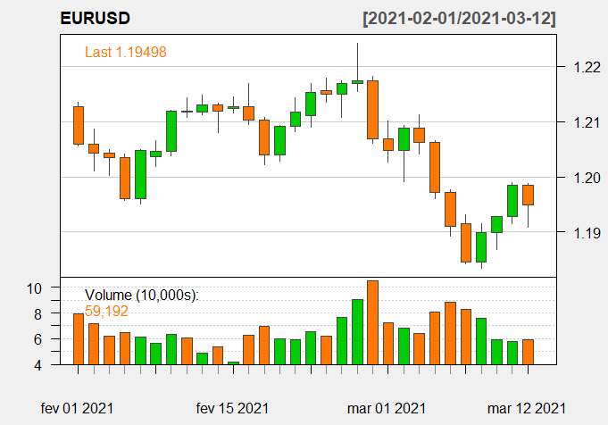

<!-- README.md is generated from README.Rmd. Please edit that file -->

```{r, include = FALSE}
knitr::opts_chunk$set(
  collapse = TRUE,
  comment = "#>",
  out.width = "50%"
)
library(mt5R)
library(quantmod)
```

# mt5R 

<!-- badges: start -->
[](https://www.tidyverse.org/lifecycle/#experimental)
<!-- badges: end -->

## Overview

[mt5R](https://kinzel.github.io/mt5R/) is an [R](https://www.r-project.org) package that provides a framework for MT5 users that want to achieve Machine Learning analysis and trading. It provides easy integration with socket connection to reach maximum performance.

Package has 31 functions (check [**Reference**](https://kinzel.github.io/mt5R/reference/index.html) tab):

Purpose | # functions
------------- | -------------
Trading          | 15
Machine Learning | 5
Others           | 11

## Example

This is a basic example to load `EURUSD` data, using time frame of 5 minutes `iTF = 5`:

```{r getsymbol}
MT5.GetSymbol("EURUSD", iTF = 5, iRows = 5)

## Using xts package
MT5.GetSymbol("EURUSD", iTF = 5, iRows = 5, xts = TRUE)
```

Plot `MT5.GetSymbol` output using [quantmod](https://CRAN.R-project.org/package=quantmod) package:

```{r plot, fig.align= "center", eval=F}
library(quantmod)
Table = MT5.GetSymbol("EURUSD", iTF = 5, xts = T) 
quantmod::chartSeries(Table, theme = "white")
```

<!-- For some reason, the plot created in the chunk appears in .md but not in the site. Now using an image previously created -->

<center></center>


Buy `0.001` `EURUSD` at `1.2206`:

```{r openorder2, eval=F, message=FALSE}
MT5.SingleOrder("EURUSD", iCmd = 0, fVol = 0.001, fPrice = 1.2206) 
```

Check open positions:

```{r positions}
MT5.ShowPositions()
```


Looking for more examples? Good! Check [**Articles**](https://kinzel.github.io/mt5R/articles/) tab for more simple examples.

### Installation

Assuming that you have installed MT5 and successful connected to one broker server. If you don't have it yet, don't panic: **MT5 is free** for most of brokers!

Installation is divided into two parts:

1. mt5R in R
2. mt5R in MT5

#### Instructions: Installing mt5R in R 

Install the development version from GitHub with:

```{r, eval = FALSE}
#install.packages("devtools")
devtools::install_github("Kinzel/mt5R@main") 
```

#### Instructions: Installing mt5R in MT5

To mt5R works you must use the mt5R Expert Advsior in your MT5. 

There are two installation options for mt5R in MT5:

* `.ex5`: _"Plug and play"_ version. The most suitable version for most.
* `.mq5`: for developers.

For _"Plug and play"_ version `.ex5` (`mt5R v0_1_2.ex5`)

1. [Download `mt5R v0_1_2.ex5`](https://github.com/Kinzel/mt5R/raw/main/MT5%20files/mt5R%20v0_1_2.ex5).
2. Move `mt5R v0_1_2.ex5` to `...\MQL5\experts\` folder. To check where MT5's folders, open MT5 and `Tools > Options > Storage`.
  
And you're ready to go!

***  

(If you're not a developer, go ahed to **Getting Started**)

**Alternatively**, for MQL developers you can also download the `.mq5` code used to generate `mt5R v0_1_2.ex5`. Both are exactly the same code, it's the no compiled version. This is the choice recommend for who want to tailor their own solutions and functions.

* For non compiled version `.mq5` (`mt5R v0_1_2.mq5`) - The most suitable for developers.
  + [Download socket library: socket-library-mt4-mt5.mqh](https://www.mql5.com/en/blogs/post/706665) or ([Direct Link](https://c.mql5.com/6/865/socket-library-mt4-mt5.mqh)).
  + Move `socket-library-mt4-mt5.mqh` to `...\MQL5\include\` folder.
  + [Download `mt5R v0_1_2.mq5`](https://github.com/Kinzel/mt5R/raw/main/MT5%20files/mt5R%20v0_1_2.mq5).
  + Move `mt5R v0_1_2.mq5` code to `...\MQL5\experts\` folder.
  + Open MetaEditor (F4).
  + Compile `mt5R v0_1_2.mq5`.
  + If everything run smooth an executable program file `mt5R v0_1_2.ex5` (or the name you chose) will be generated.
  
***
  
### Getting Started

Attach `mt5R v0_1_2.ex5` to any chart opened in your MT5, like any other Expert Advisor.


Check your "Expert" tab to this message:


Execute those commands:

```{r mt5ping}
library(mt5R)

MT5.Ping()
```

If it returns ``TRUE`` everything has been successfully installed and you're ready to use mt5R! Yay!

### Creating your own functions

The most awesome part of MT5 is make reliable to create your owns solutions and functions. The cookbook is still under construction, but you can start checking functions `MT5.zExample` in mt5R package and `Z1` order in `mt5R v0_1_2.mq5`. Its pretty easy!

```{r z1example, eval = F}
## Execute the function without () to see its code
mt5R::MT5.zExample
```

### Contributing

If you want to contribute to mt5R send me an email (guikinzel@gmail.com) with your GitHub account.

### See Also

- [quantmod](https://CRAN.R-project.org/package=quantmod): quantitative financial modeling framework
- [TTR](https://CRAN.R-project.org/package=TTR): functions for technical trading rules
- [xts](https://CRAN.R-project.org/package=xts): eXtensible Time Series based
- [zoo](https://CRAN.R-project.org/package=zoo): S3 Infrastructure for Regular and Irregular Time Series

### Credits

- [JC](https://www.mql5.com/en/users/jjc)  without his awesome socket library mt5R would not be possible!

### Author

Guilherme Kinzel
