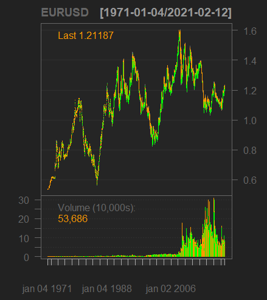
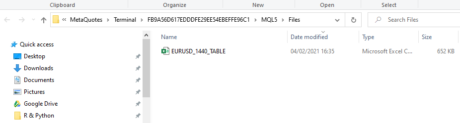
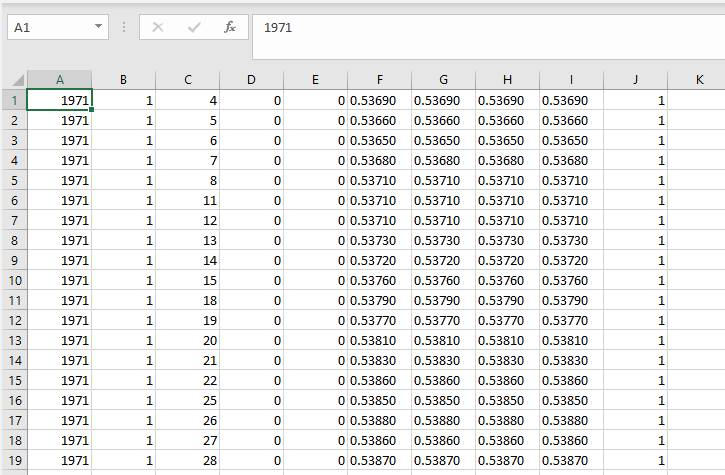

```{r, include = FALSE}
knitr::opts_chunk$set(
  collapse = TRUE,
  comment = "#>"
)
```

# Daily EURUSD data 

Simple example to have access of daily `EURUSD` dataset of MT5 server broker. 

## Content:
* Usage of function `MT5.GetSymbol()`.
* How long it takes.
* Check the data.
* Plotting it.
* Using `bDeletecsv = FALSE`.

Load `mt5R`.

```{r setup}
library(mt5R)
```

Let's check if `mt5R` in MT5 plataform is listening.

```{r}
MT5.Ping()
```

Everything is fine! Let's continue.

To reasonable size of data the best practice is to use the function `MT5.GetSymbol()`. To small chunks try `MT5.Quick_GetSymbol()` instead.

To obtain all the available data use `iRows = Inf` (`mt5R` 0.1.3 or newer versions), `iTF = 1440` is to obtain daily data, check `?MT5.GetSymbol`.

```{r data, eval=F}
TimeStart <- Sys.time() ## Lets check how long it takes. Starting the chronometer!
EURUSD <- MT5.GetSymbol("EURUSD", iTF = 1440, iRows = Inf, xts = TRUE)
TimeEnd <- Sys.time() ## Saving the time when it ended
```

```{r, include = FALSE}
## Save time to create package site
## To run everything as should be, change eval to TRUE in above chunk and delete this one
library(xts)
load("F:/Pacotes/mt5R/EURUSD_Data.RData", env <- new.env())
EURUSD <- env$EURUSD
TimeStart <- env$TimeStart
TimeEnd <- env$TimeEnd
```

**Finally!**

It's a huge dataset. Lets get a closer look?

How long it took to download all the data?

```{r}
print(TimeEnd-TimeStart)
```
The time requirement scales linearly, it will takes considerable amount of time for very huge datasets - since a `.csv` is created and the data is stored. To quickier load of data use `MT5.Quick_GetSymbol()` instead.


Check dimensions of `Data`.

```{r}
dim(EURUSD)
```
It's 12,910 days of `OHLC` data.

Let's check the first lines of `EURUSD`.

```{r}
head(EURUSD)
```

Let's check the end lines of `Data`.

```{r}
tail(EURUSD)
```

You can plot the `EURUSD` using [quantmod](https://cran.r-project.org/web/packages/quantmod/quantmod.pdf).

```{r, eval = F}
library(quantmod)
quantmod::chartSeries(EURUSD)
```
<!-- For some reason, the plot created in the chunk appears in .md but not in the site. Now using an image previously created -->

<center></center>


To make `EURUSD` obtained available to other softwares (Python and etc), you can also use `MT5.GetSymbol()` using the argument `bDeletecsv = FALSE`.

```{r, eval=F}
EURUSD <- MT5.GetSymbol("EURUSD", iTF = 1440, iRows = Inf, bDeletecsv = FALSE)
```

It will left a `.csv` table downloaded that was used. The table can be found in `Files` of MT5's folder. To find out specifically where it is located you can use the function `MT5.FileWorkingFolder()`.

```{r}
MT5.FileWorkingFolder()
```

#### Looking at MT5's folder:



#### How `csv` is structured:


